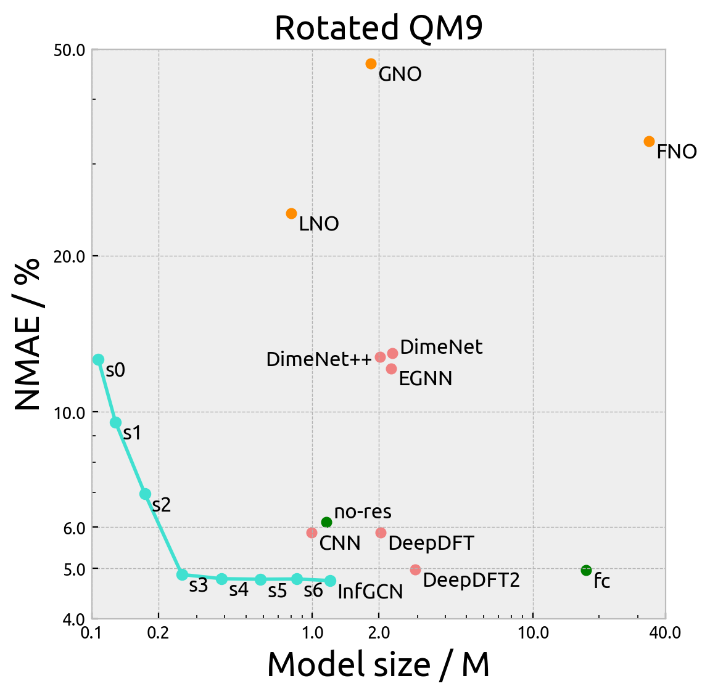
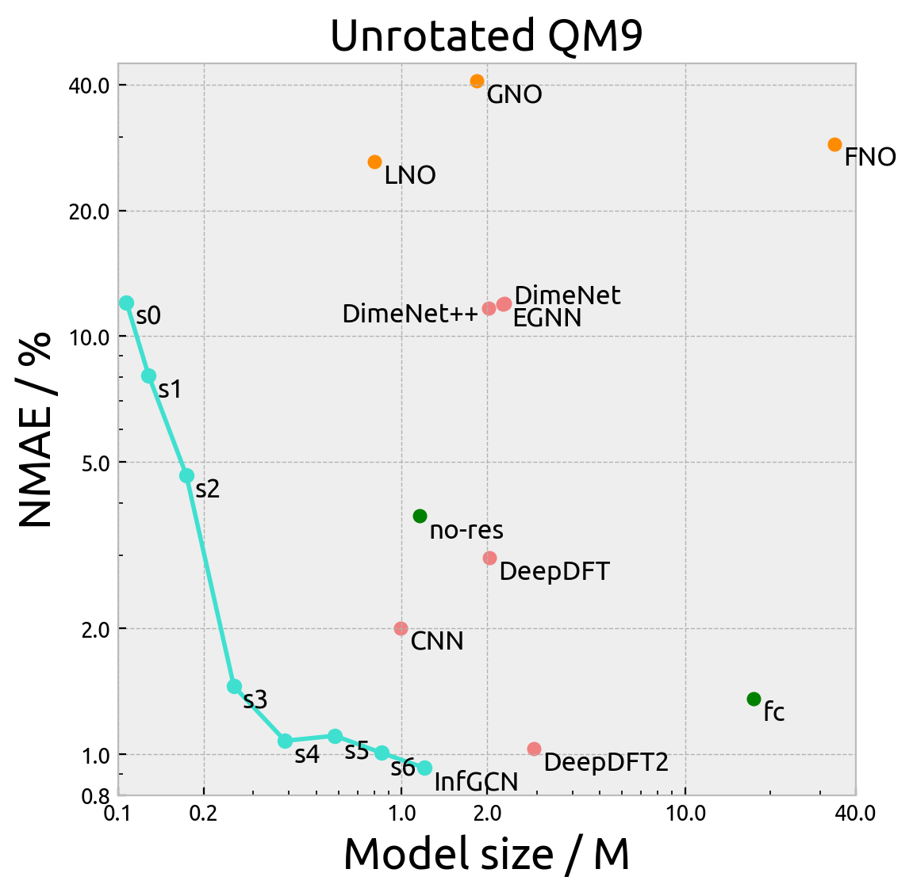

# InfGCN for Electron Density Estimation

By Chaoran Cheng, Oct 1, 2023

Official implementation of the NeurIPS 23 spotlight paper *Equivariant Neural Operator Learning with Graphon Convolution* for
modeling operators on continuous data.

## Requirements

All codes are run with Python 3.9.15 and CUDA 11.6. Similar environment should also work, as this project does not rely
on some rapidly changing packages. Other required packages are listed in `requirements.txt`.

## Datasets

### QM9

The QM9 dataset contains 133885 small molecules consisting of C, H, O, N, and F. The QM9 electron density dataset was
built by Jørgensen et al. ([paper](https://www.nature.com/articles/s41524-022-00863-y)) and was publicly available
via [Figshare](https://data.dtu.dk/articles/dataset/QM9_Charge_Densities_and_Energies_Calculated_with_VASP/16794500).
Each tarball needs to be extracted, but the inner lz4 compression should be kept. We provided code to read the
compressed lz4 file.

### Cubic

The Cubic dataset contains electron charge density for 16421 (after filtering) cubic crystal system cells. The dataset
was built by Wang et al. ([paper](https://www.nature.com/articles/s41597-022-01158-z)) and was publicly available
via [Figshare](https://springernature.figshare.com/collections/Large_scale_dataset_of_real_space_electronic_charge_density_of_cubic_inorganic_materials_from_density_functional_theory_DFT_calculations/5368343).
Each tarball needs to be extracted, but the inner xz compression should be kept. We provided code to read the compressed
xz file.

**WARNING:** A considerable proportion of the samples uses the rhombohedral lattice system (i.e., primitive rhomhedral
cell instead of unit cubic cell). Some visualization tools (including `plotly`) may not be able to handle this.

### MD

The MD dataset contains 6 small molecules (ethanol, benzene, phenol, resorcinol, ethane, malonaldehyde) with different
geometries sampled from molecular dynamics (MD). The dataset was curated
from [here](https://www.nature.com/articles/s41467-020-19093-1) by Bogojeski et al.
and [here](https://arxiv.org/abs/1609.02815) by Brockherde et al. The dataset is publicly available at the Quantum
Machine [website](http://www.quantum-machine.org/datasets/).

We assume the data is stored in the `<data_root>/<mol_name>/<mol_name>_<split>/` directory, where `mol_name` should be
one of the molecules mentioned above and split should be either `train` or `test`. The directory should contain the
following files:

- `structures.npy` contains the coordinates of the atoms.
- `dft_densities.npy` contains the voxelized electron charge density data.

This is the format for the latter four molecules (you can safely ignore other files). For the former two
molecules, run `python generate_dataset.py` to generate the correctly formatted data. You can also specify the data
directory with `--root` and the output directory with `--out`.

All MD datasets assume a cubic box with side length of 20 Bohr and 50 grids per side. The densities are store as Fourier
coefficients, and we provided code to convert them.

## Running the code

Most hyperparameters are specified in the config files. More parameters in the YAML file is self-explanatory.
See [this readme](configs/README.md) for more details on modifying the config files. Free feel to modify the config
files to suit your needs or to add new models.

### Training

To train the model, run

```bash
python configs/qm9.yml --savename test
```

### Evaluation

To evaluate the model, run

```bash
python configs/qm9.yml --savename test --mode inf --resume <model_path>
```

### Inference

To see the visualization of the predicted density, run [inference.ipynb](inference.ipynb) with JupyterLab or Jupyter
Notebook.

### Extending to other models

To utilize the code for other (GNN-based) models, you need to register the model class in using
the `models.register_model` decorator. Your model's `forward` function should take same arguments as our InfGCN, but the
initialization arguments can be different (see the [instructions](configs/README.md) on modifying the config file).

## Result

The below figures demonstrate the normalized mean absolute error (NMAE) vs the model size of our model and all the baseline model on the QM9 dataset. Here, `s0` to `s6` refer to the maximum degree of spherical harmonics used in the model (InfGCN is `s7`). `no-res` refers to the model without residual connection and `fc` refers to the model without fully-connected tensor product. The pink points are interpolation GNNs and oranges points are neural operators.

<div style="justify-content: center">


</div>

## Citation

If you find this code useful, please cite our paper

```bibtex
@InProceedings{Cheng2023infgcn,
  title={Equivariant Neural Operator Learning with Graphon Convolution},
  author={Chaoran Cheng and Jian Peng},
  booktitle={Advances in Neural Information Processing Systems 37: Annual Conference on Neural Information Processing Systems 2023, NeurIPS 2023, December 10-16, 2023},
  month={December},
  year={2023},
}
```
